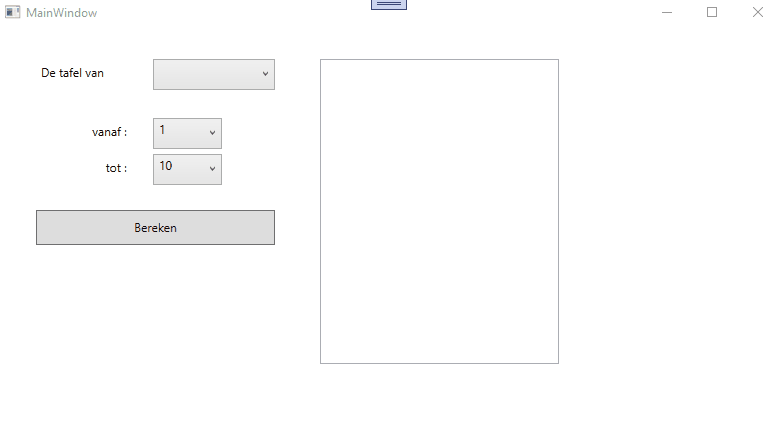

# Lussen en collecties : oefening 2  

Nadat je de code hebt binnengehaald bestudeer je eerst even de controls die zich op het venster bevinden zodat je weet welke controls er zijn en hoe ze heten.  

Vooraleer je begint te programmeren, bekijk aandachtig deze korte demo : 

  

Tijdens de opstart van je programma die je de 3 comboboxen te vullen   
  
  * cmbBasisgetal vul je met gehele getallen van 1 t/m 100   
  * cmbVan vul je met gehele getallen van 1 t/m 50.  Je zorgt er eveneens voor dat het getal 1 geselecteerd staat nadat je de combobox hebt gevuld.  
  * cmbTot vul je met gehele getallen van 1 t/m 50.  Je zorgt er eveneens voor dat het getal 10 geselecteerd staat nadat je de combobox hebt gevuld.  
  
Je zorg er eveneens voor dat lblFout bij opstart onzichtbaar wordt gemaakt.  
  
Klik je op berekenen en in cmbBasisgetal is niets geselecteerd, dan toon je een fout in lblFout.  
Klik je op berekenen en in cmbTot is een kleiner getal geselecteerd dan in cmbVan, dan toon je een fout in lblFout.  

Staat alles goed, dan toon je de tafel van vermenigvulding zoals getoond in het filmpje.  
